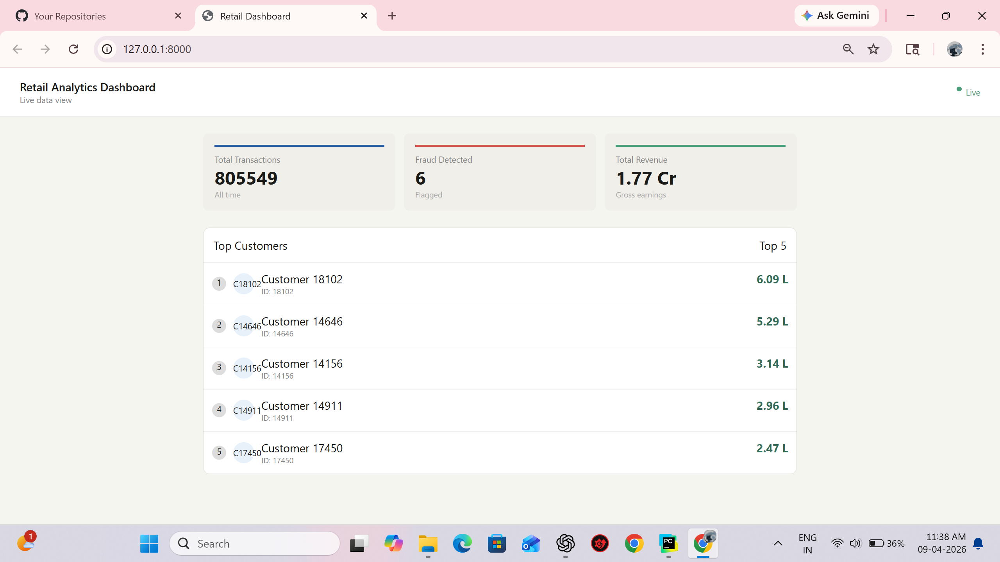
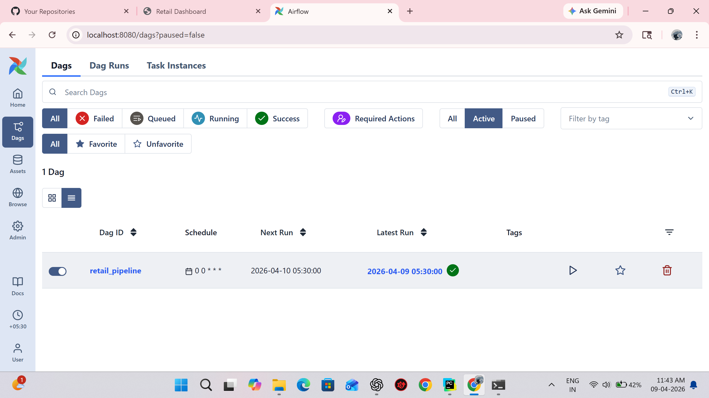
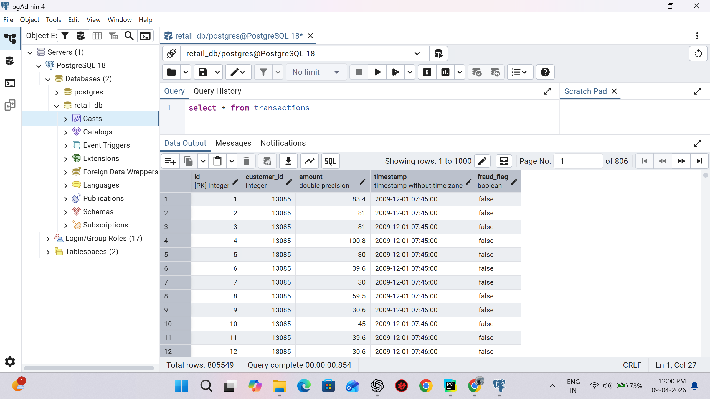

# 🛒 Retail Data Platform 🚀

### End-to-End Data Engineering Pipeline using Airflow, PySpark, PostgreSQL & Django

---

## 📌 Overview

This project demonstrates a **production-style data engineering pipeline** that ingests, processes, stores, and visualizes retail transaction data.

It simulates a real-world system used by companies to generate **business insights from raw data**.

---

## 🧠 Problem Statement

Retail businesses generate large volumes of transactional data daily.
Traditional systems struggle with:

* ❌ Handling large-scale data efficiently
* ❌ Automating data pipelines
* ❌ Generating real-time insights

👉 This project solves these challenges using a **scalable and modular architecture**.

---

## 🏗️ Architecture

```
          +-------------------+
          |   CSV Data        |
          | (transactions)    |
          +---------+---------+
                    |
                    v
          +-------------------+
          |   Apache Airflow  |
          |   (ETL Orchestration)
          +---------+---------+
                    |
                    v
          +-------------------+
          |   Apache Spark    |
          | (Data Processing) |
          +---------+---------+
                    |
                    v
          +-------------------+
          |   PostgreSQL DB   |
          | (Structured Data) |
          +---------+---------+
                    |
                    v
          +---------------------+
          |   Django Dashboard  |
          | (Data Visualization)|
          +---------------------+
```

---

## 🧰 Tech Stack

| Layer         | Technology             |
| ------------- | ---------------------- |
| Orchestration | Apache Airflow         |
| Processing    | Apache Spark (PySpark) |
| Database      | PostgreSQL             |
| Backend       | Django                 |
| Language      | Python                 |

---

## ⚙️ Features

✔ Automated ETL pipeline using Airflow
✔ Scalable data processing using PySpark
✔ Structured storage using PostgreSQL
✔ Web-based dashboard using Django
✔ Displays key metrics:

* Total Transactions
* Revenue
* Top Customers
* Fraud Flag

---

## ▶️ How to Run the Project

### 🔹 1. Start Airflow

```bash
airflow scheduler
airflow webserver
```

---

### 🔹 2. Run Spark Job

```bash
python spark_jobs/transform.py
```

---

### 🔹 3. Load Data into PostgreSQL

```bash
python storage/load_to_db.py
```

---

### 🔹 4. Run Django Server

```bash
cd dashboard_project
python manage.py runserver
```

---

## 📊 Output Dashboard

The Django dashboard provides:

* 📈 Total transactions
* 💰 Revenue insights
* 👥 Top customers
* ⚠️ Fraud flag display

---

## 📸 Screenshots

> Add your screenshots here

```



```

---

## ⚠️ Challenges & Solutions

| Challenge             | Solution                       |
| --------------------- | ------------------------------ |
| File path errors      | Used consistent relative paths |
| Spark setup issues    | Fixed Java compatibility       |
| Django routing issues | Manually configured urls.py    |
| DB integration        | Unified schema across pipeline |

---

## 🚀 Future Enhancements

* 🔥 Machine Learning for Fraud Detection
* ⚡ Real-time streaming using Kafka
* 📊 Advanced visualizations (charts)
* ☁️ Cloud deployment (AWS / Docker)

---

## 💼 Skills Demonstrated

* Data Engineering
* ETL Pipeline Design
* Distributed Computing
* Backend Development
* Database Management

---

## 👨‍💻 Author

**Purushothaman S**
🔗 GitHub: https://github.com/Purushothaman-Swamynathan

---

## ⭐ Support

If you found this project useful:

👉 Give it a ⭐ on GitHub
👉 Share it on LinkedIn

---

## 📢 Highlight

> This project showcases the ability to build a **complete data pipeline from scratch**, integrating multiple technologies used in real-world data engineering systems.
